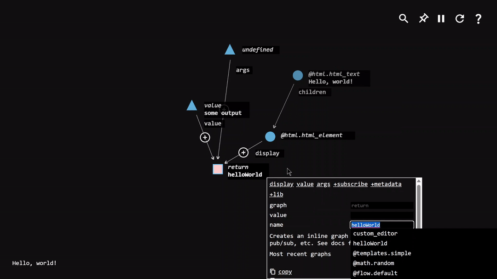
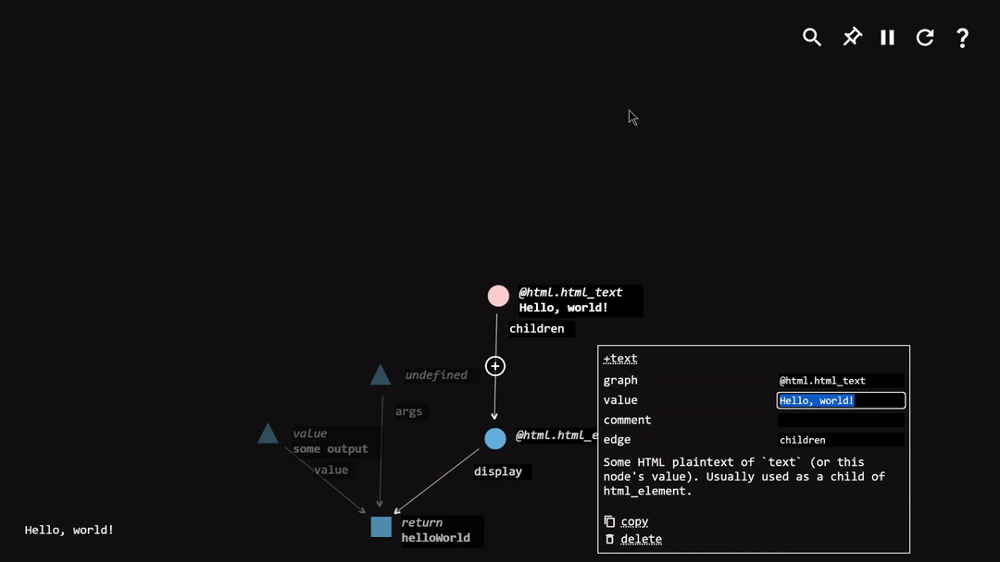

# Common operations

## Opening or creating a graph

Click on the output node of the graph and change the name by typing and selecting an option or clicking away. If a graph with that names exists, the graph will open. 

If a graph with that name does not exist, then a new graph will be created. The new graph will be a copy of the old graph but with the new name. You can use the new name in the `graph` field of any node.

## Updating a node

Click on a node field to open the node info window and automatically highlight that field. Changes are automatically saved when you click away.

## Importing a graph

# Tour of Nodysseus

[UI Overview Tutorial](https://www.youtube.com/watch?v=K-oUsrV3n6s&list=PLNf6veBQIZNohZk_htvTvPCB2UnEl3Tlh) main points below

1. Overall interface
	1. Center - node graph
	   Shows the open graph. Programming happens here. E.g. this is showing the `tutorial` graph
	2. Bottom left / background - html display of graph
	   The html output  created by the `display` input to the last node. E.g. the "Hello, world!" text from an `html_element` and `html_text`. The display can be split up into `background` and `resultPanel` inputs if both a background and regular display are used (like in the [three.js example](https://nodysses.io/#threejs_example)).
	3. Top right - controls
	   Find: searches the open graph for text
     Pin: pins the display to the current graph
     Refresh: refreshes the graph layout
     Undo/redo: undo / redo the most recent local changes
	4. Popup - node info
	   Change the node properties and interact with custom controls.

2. Node graph
   The currently open graph
	1. Output node - the last node of the graph. Controls things that a "file" menu would do in most applications such as opening a graph, renaming the current graph, and saving.
	2. Nodes 
	   Run javascript functions. A node can have a `ref` (short for reference) to another graph and a `value`. The output of a node changes based on its inputs, `value`, and `ref`. A `ref` is similar to a named javascript function. The inputs are similar to named javascript function arguments. `value` can change the behavior of the node and is often used in place of a specific argument.
	   Without a `ref` or `value` set, a node will create a javascript object of its inputs.
		1. First line - value or name (if set) of the node e.g. "Hello, world!"
		2. Second line - node reference e.g. `html_text` 
	3. Edges
	   Connects two nodes. The input node's output will be passed as a named argument to the output node with the name of the edge label. An edge's input node is called the "parent" of the edge's output node. Likewise, an output node is the "child" of the edge's input node. A node can have many parents (inputs) but only one child (output). All of the nodes above a node (a node's parents and their parents, etc) are the node's ancestors.
		1. Name - the name to use when calling the output node's function e.g. `display`. 
		2. (+) icon - inserts a node into the specified edge preserving the edge name

3. Node info
   A dialog to change the currently selected node's attributes
	1. Argument list - shows the valid input arguments along with `arg[x]`. `arg[x]` is used in some graph references, but can generally be ignored. Clicking on one will create a new node if that one doesn't exist, or go to that node if it does.
	   E.g. `step` and `label` for a `slider`
	2. value - the current value of the node. This is used by graphs for various things, usually in place of a specific argument. 
	   E.g. `s1` for the shown slider (it replaces the `label` input argument)
	3. name - the name of the node. On the last node, this changes the open graph if one matching the name exists. If a graph of that name does not exist it renames the open graph. On all other nodes it is primarily for display purposes.
	4. ref - the graph that this node refers to. There are a number of graphs available by default, but any saved graph will also show up here by name.
	5. edge - the argument name to use for this node's data in the output node
	6. Custom `display` - the display of the `ref` graph. E.g. the `slider` graph has a label and `<input type="range" />` element 
	7. Actions
	   Things you can do to the node
		1. `collapse` - collapses the node and it's ancestors into a single node-graph. The node-graph will keep the name.
		2. `copy` - copies the node and ancestors as a node-graph
		3. `paste` (if there's a copied node) - pastes the copied node-graph preserving the output edge
		4. `delete` - deletes the node
		5. `save` (if on the output node) - saves the current graph by its name. Nodes in any graph can use this name as a `ref`.

